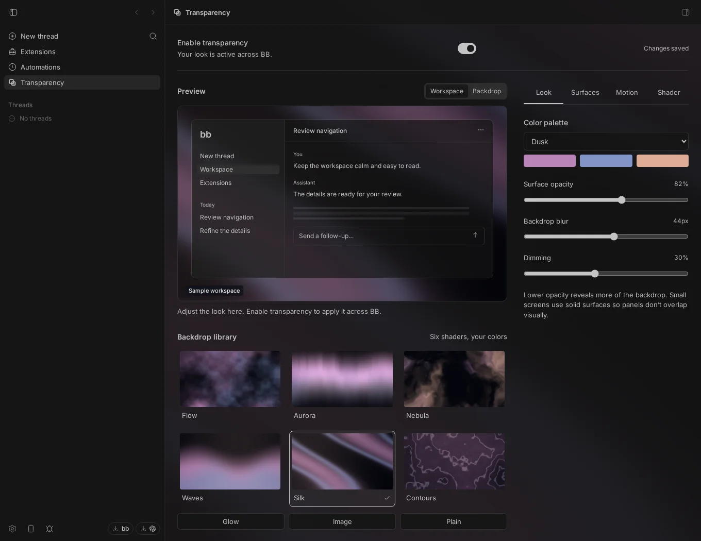
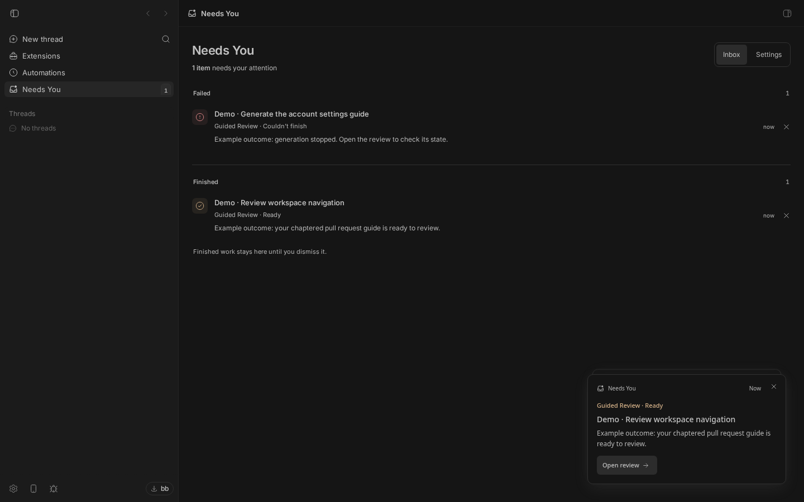
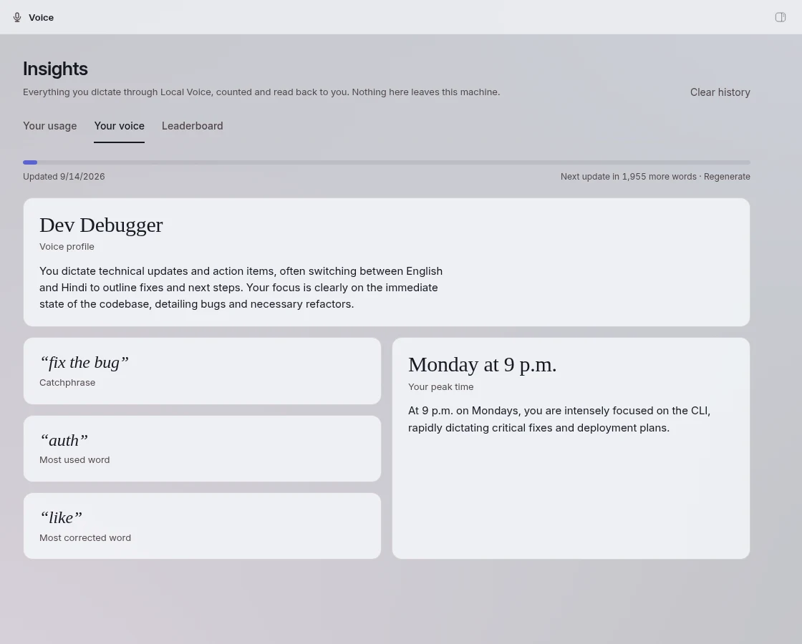

I run most of my day inside [bb](https://getbb.app), an IDE built around agent threads instead of files. It has a plugin SDK, and at some point I stopped asking "can bb do X" and started writing the plugin that made it do X.

The folder now holds somewhere north of twenty plugin projects. Three are on the reviewed BB Community marketplace: Guided Review, Needs You and Transparency. The rest are the ones that turned bb into *my* tool: an inbox for agent questions, a dictation engine that runs locally, a finance tracker, a Gmail triage worker, a butler thread that watches the others.

This is what a plugin is, how one is built, and the five things I would have liked to know first.

* * *

## What a plugin is

A plugin is a TypeScript package with a `bb` block in its `package.json`. Two entry points do the work: `server.ts` runs inside the bb server and default-exports a factory that receives the plugin API; `app.tsx` is optional and runs in the bb frontend.

```json
"bb": {
  "name": "Tally",
  "description": "Full personal-finance tracker: expenses by day/week/month, budgets & predictions, recurring bills …",
  "branding": { "icon": "./assets/icon.svg" },
  "server": "./server.ts",
  "app": "./app.tsx"
}
```

From the server factory you can register CLI commands (`bb tally overview`), agent tools, RPC methods for your frontend, settings with a generated UI, background services and cron schedules, HTTP routes, realtime channels, and get a SQLite database and a key-value store for free. From the frontend entry you can add a sidebar panel, a settings section, a composer customisation, or a content script that touches the whole app. Plugins are full-trust code inside bb. There is no sandbox to hide behind.

* * *

## The surface that changed how I work: agent tools

Everything else is ordinary application development. Agent tools are the new thing. Register one and every agent thread in bb can call it as a native tool, with typed arguments, the same way it calls "read file".

This is a real one from Tally, unchanged:

```ts
bb.agents.registerTool({
  name: "tally_overview",
  description: "Spending overview for a period: totals, top categories/merchants, budget status, and this-month prediction.",
  parameters: z.object({ period: z.enum(["day", "week", "month", "year"]).default("month") }),
  presentation: { label: { pending: "Reading finances", completed: "Read finances" } },
  execute({ period }) {
    const { from, to } = d.an.periodBounds(period);
    const txns = d.store.listTransactions(d.db, { from, to, limit: 5000 });
    // …summarise, group, predict…
    return lines.join("\n");
  },
});
```

Three details matter more than they look.

`parameters` is a zod schema, so a bad argument from the model becomes a tool error the agent can read and retry, not a crash in your plugin. `presentation` is what the user sees in the timeline while it runs. And an optional `instructions` field tells the agent *when* to reach for the tool. The tracker plugin's `tracker_add_task` says, roughly, "when the user asks to add a todo, call this with a concise imperative title", and that one sentence is the difference between a tool that exists and a tool that gets used.

Tool names must be unique across plugins. The convention that has held up is `<plugin>_<verb>`: `tally_overview`, `tracker_add_task`, `alfred_spawn`. When I open a thread now, the agent has dozens of these, and I did not have to teach it a single one.

* * *

## The surface users see: a panel in ten lines

Transparency's whole frontend registration:

```tsx
import { definePluginApp } from "@get-bb/plugin-sdk/app";
import { mountGlass } from "./backdrop";
import { GlassPanel } from "./glass-panel";

export default definePluginApp((app) => {
  app.contentScripts.register({ id: "glass", mount: mountGlass });
  app.slots.navPanel({ id: "glass", title: "Transparency", icon: "Layers", path: "glass", component: GlassPanel });
  app.slots.settingsSection({ id: "glass", title: "Transparency", component: GlassPanel });
});
```

A sidebar entry, a settings section, and a content script that paints the backdrop behind the entire app. The panel talks to the server through an RPC contract defined once in zod and consumed type-only on the client, so the frontend cannot call a method the server did not declare.



* * *

## The loop

```bash
bb plugin new hello        # scaffolds ./bb-plugin-hello
cd bb-plugin-hello
bb plugin install .        # registers the directory in place
bb plugin dev              # rebuilds and reloads on every save
bb plugin logs hello -f    # your bb.log output
```

Path installs load `server.ts` as TypeScript directly. The frontend bundle is compiled for you by `bb plugin dev` while you work and by `bb plugin build` when you publish, and the build refuses an SVG icon that carries a script.

* * *

## The three public ones

**Needs You** is one inbox for the three things that stop an agent thread: a question, a failed run, a finished job. One dismissible popup per thread, an activity API other plugins can push into, and optional Telegram pings through your own bot. Guided Review uses that API to tell you a guide is ready.



**Transparency** makes bb translucent: six animated backdrops, a shader editor where you can write your own GLSL with a live preview, import and export, and quality tiers so a laptop on battery is not rendering a million pixels at thirty frames a second.

**Guided Review** turns a pull request into an agent-written, chaptered reading order and lets you review and submit from inside bb. It got [its own post](/a-pull-request-is-a-diff-sorted-by-filename).

All three: `bb plugin install <guided-review|inbox|glass>@bb-community`.

* * *

## The ones that run my day

**Local Voice** is dictation that never leaves the machine. A speech model and a small language model run on the bb host and turn Hindi, Hinglish or English speech into clean written English in any text field, with a usage view and an opt-in leaderboard that only ever shares counts. It is on my own marketplace rather than the community one, for now.



**Alfred** is a single pinned thread with tools to see what every other thread is waiting on, relay my answers to them, spawn workers, and remember what I told it. **Mailroom** indexes Gmail and triages it with rules and a classifier worker. **Tally** reads those receipts and keeps the budget honest. **Atlas** is tasks and notes with wikilinks and an activity graph. **Switch Machine** moves a thread's work to another computer, gitignored config included.

None of these will be on a public marketplace soon, because they know my project ids and my name, and that is fine. The point of a plugin system is that the tool can be exactly as personal as you want it.

* * *

## Five things I'd tell you before your first plugin

1. **Delete the scaffold's icon before your first install.** `bb plugin new` writes `"icon": "ListTodo"` and a placeholder description, and both will ship if you let them. Icons are rendered as a monochrome mask at sixteen pixels. Simple strokes only.
2. **Name it the way it is spoken.** The package is `bb-plugin-inbox`. The plugin is Needs You. They do not have to match, and the spoken name is the one that matters.
3. **Settings do not reload the plugin.** Change one, then `bb plugin reload <id>`, or spend twenty minutes wondering why nothing changed.
4. **Migrations are append-only.** `bb.storage.migrate` takes an array of statements. Never edit a shipped one. Push a new one.
5. **CLI commands run on the server.** A path argument names a file on the machine that typed the command, which may be a different machine. Never open a user-supplied path with `node:fs` in a `run` handler.

And one for the day you go public: harden `.gitignore` (`.env`, `*.db`) before the repo flips. Two of mine have a commit called exactly that.

* * *

*Everything here is at [github.com/notpritam](https://github.com/notpritam?tab=repositories&q=bb-plugin). If you build one, tell me what surface you wished the SDK had. The list of things I want is long, and it is shorter every week.*
