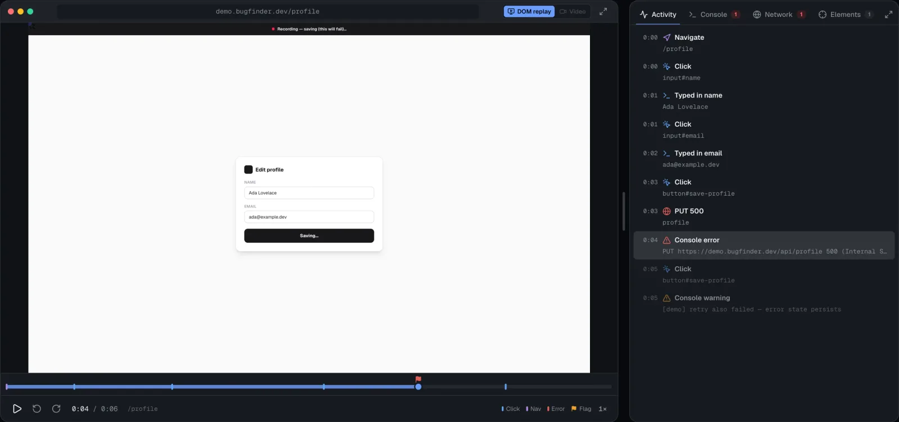

"Can you send me the steps to reproduce?"

I have typed that sentence more times than any other in my career, and it has never once produced the steps. What it produces is a screenshot of a spinner, a paragraph that starts with "I think I clicked", and a bug that cannot be reproduced because the interesting part happened thirty seconds before anyone thought to look.

Bug Dossier is my answer. It is a Chrome extension that records everything the browser knew while the bug happened, and a dashboard that files that recording as a report a human can read and an AI agent can investigate. Live at [bugdossier.com](https://bugdossier.com), extension on the [Chrome Web Store](https://chromewebstore.google.com/detail/bug-dossier/nljfaocpdpoijkinipdijgdemefflnoe). There is a [public demo capture](https://bugdossier.com/demo-capture) you can open without an account.

* * *

## What a recording actually contains

Press ⌘⇧U, do the thing, press stop. One filed session holds:

- **Pixel replay** of the page (rrweb), with a rolling pre-roll buffer of about two minutes. The failure you noticed *after* it happened is usually in the buffer.
- **Every network request** with method, URL, status, timing, and the full request and response bodies, which is the part a HAR file leaves out.
- **Console entries** with component stacks, deduplicated, filterable by level.
- **The DOM at any moment**, rebuilt from the replay, so you can prove a button was disabled at 00:41 and enabled at 00:43.
- **Application state**: Redux, TanStack Query and `useState` baselines with RFC 6902 patches, so you can see what the app *believed*, not just what it painted.
- **Cookies, including httpOnly ones**, which page JavaScript cannot see and which are therefore missing from every bug report you have ever received.
- **The browser's own log**: CORS blocks, CSP violations, mixed content, deprecations. These never reach `console.*`.
- Storage changes, screenshots, picked elements with their layout measurements, and the pointer, scroll and input trail.

The reporter reviews the draft, adds a sentence, and files it. It gets an id like BF-123, a page with replay and inspectors, and a thread.

* * *

## The part built for agents

Everything above is available over MCP. Point Claude Code (or anything that speaks MCP) at a workspace and it gets around thirty tools. The ones that matter most:

- `get_session` returns the whole capture as a briefing: report, environment, errors, failed calls, picked elements, the interaction trail. Read this first.
- `get_network_entry` gives one request with headers and both bodies. The tool description says the thing I wish every engineer knew: *the response that contains the bad data is usually a 200 that the failed-calls list never shows.*
- `get_dom_at` and `get_app_state` answer "what did the page look like" and "what did the app think" at a timestamp.
- `get_cookies` and `get_browser_log` cover the two categories that are invisible from inside the page.
- `post_finding` writes a conclusion back to the thread as structured blocks rather than a paragraph: a Mermaid diagram of the failing flow, a code block with the bad lines, an observed-versus-expected table, and evidence links that jump to the exact network entry or DOM moment.
- `watch` and `get_updates` let an agent follow a session or an initiative and learn about new comments, status changes or new evidence without polling.

The evidence itself is read-only over MCP. An agent can change status, severity and tags, and it can post findings. It cannot edit a recording.

Picture the checkout that silently drops a coupon. A tester records it. An agent reads the session, notices the coupon request returned 200 with `applied: false`, pulls the response body, diffs the app state before and after, and posts a finding with the exact field, the request id, and a two-line fix proposal. Nobody typed "steps to reproduce".

* * *

## How it is built

The extension is Manifest V3, React 19 and rrweb. One script runs in the page's main world and wraps `console`, `fetch`, `XMLHttpRequest`, `history` and error events. Another runs isolated and buffers the replay, the pointer trail and screenshots. Response bodies and httpOnly cookies come through the DevTools protocol, which is the only place the browser will give them up.

The dashboard backend is a single Go binary (chi, MongoDB), one database per organisation. It runs under systemd behind Caddy on a box I control. Evidence goes to S3 through presigned uploads, so large recordings never pass through the API server. Organisation subdomains are hard tenant boundaries: nothing cross-tenant is allowed to render on them.

Sessions can be grouped into initiatives that collect related reports by tag, teams have member roles and an access-request flow, and updates fan out over server-sent events and Web Push.

* * *

## Three decisions I would make again

**Capture bodies, not summaries.** A network waterfall without bodies is a list of numbers. The bug is in the JSON.

**Make state a first-class capture.** The DOM lies by omission. A button that is enabled in the DOM and disabled in the store is a bug you cannot see in a screen recording. Storing baselines plus patches keeps the state history small and lets you scrub it like video.

**Design the MCP tools as a briefing, then drills.** One call that tells the agent what happened, then narrow tools that prove it. Agents that start by dumping everything waste their context and miss the 200 with the bad payload.

* * *

*If your bug tracker is full of "cannot reproduce", record the next one instead. Open the [demo capture](https://bugdossier.com/demo-capture), connect an agent, and ask it what went wrong.*
