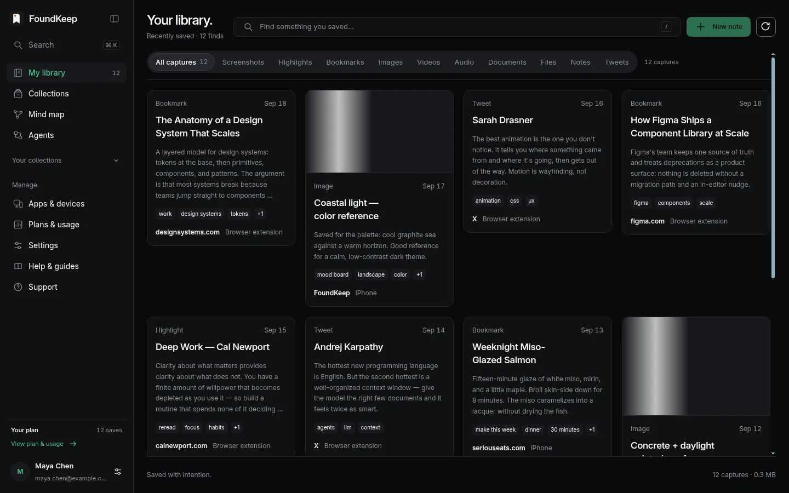
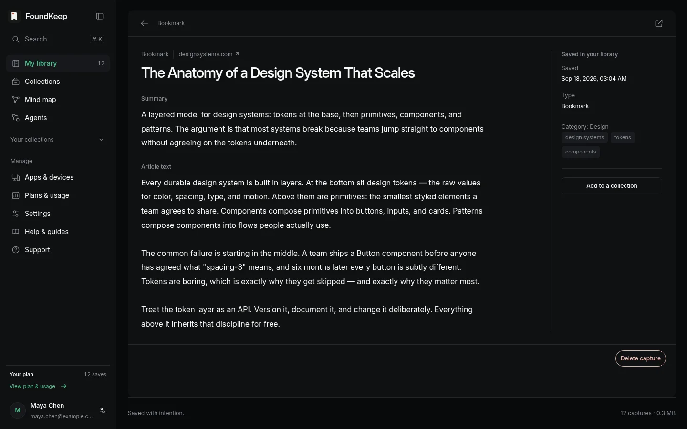
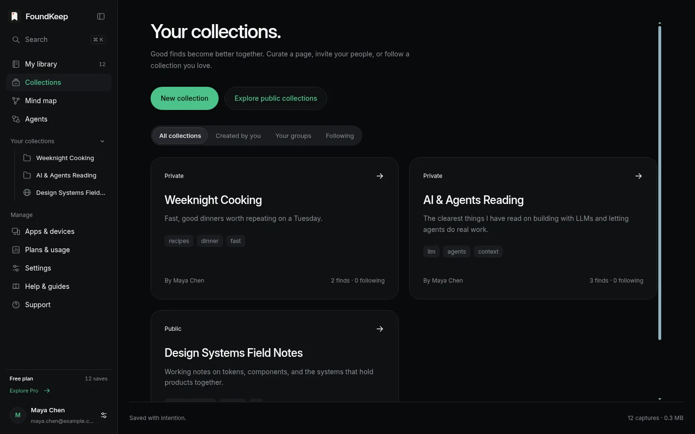
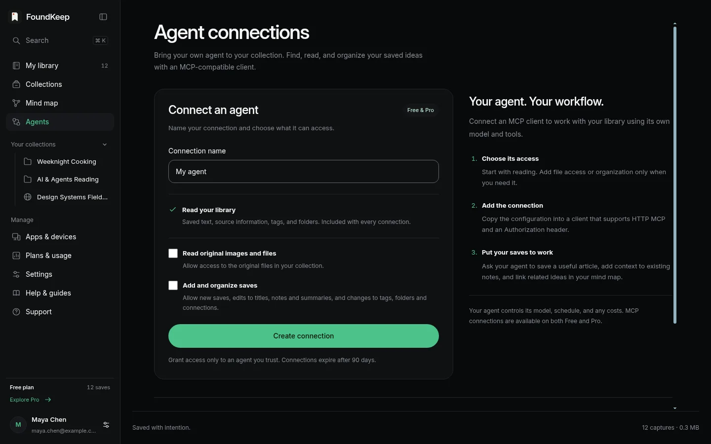

I have a folder called "read later" in every browser I have ever used. None of them helped me read anything later.

A bookmark keeps the URL and drops everything that made the page worth keeping. The paragraph you wanted was three scrolls down. The screenshot went to the desktop with a timestamp for a name. The note about *why* went to whichever app was open. Six months on, the collection is harder to search than the web it came from.

So I built the thing I wanted: one library where a page, a screenshot, a highlight or a whole thread arrives with its source still attached, and stays searchable.

It is called FoundKeep. Found it? Keep it. [foundkeep.app](https://foundkeep.app), source on [GitHub](https://github.com/notpritam/foundkeep).

* * *

## What a save actually keeps

Saving a page in FoundKeep is not saving a link. The extension pulls the readable article out of the page and stores it with its provenance: the URL you were on, the canonical URL, title, author, publisher, dates, language, the lead image, the favicon, how it was captured, and a content fingerprint so the same text is never stored twice. The raw HTML is never kept. What you get back later is the article, not a tab.

The same goes for the other kinds of things people hoard:

- **Screenshots**, region or full page. Full page is stitched, not cropped to the viewport.
- **Highlights.** Select text, save it, and the selection keeps a pointer to the page it came from.
- **Tweets and threads.** The whole thread is preserved server side: text, photos, video, and up to three linked articles, so it survives the original being deleted.
- **Images, notes, files.** Right click an image, paste a URL, or just type.
- **Your existing bookmarks.** Import from Chrome, Edge, Brave, Firefox, Safari, Opera, Vivaldi, Raindrop or any HTML export, in resumable chunks.

Every capture lands in the browser's local storage first and syncs to your account afterwards. If the network is down when you hit save, the save still happens.

* * *

## Processing is opt-in. Organizing is not.

There are two layers on top of a save, and they are deliberately separate.

The first is always on and runs without any AI: a small extractive organizer that pulls candidate tags out of the text and files the save under a category. It treats captured content as data, never as instructions. It is not clever, but it is fast and private, and it means the library is usable on day one.

The second is hosted AI processing, and it is off until you turn it on. When you do, a new save gets a short summary, suggested tags, a category, and, for images and screenshots, the text pulled out with OCR. That OCR text becomes searchable, which is the moment a screenshot of a pricing table stops being a picture and becomes a record.

Tags come in two sets: the ones the machine suggested and the ones you typed. Yours win. Folders are separate from tags, and a save sits in exactly one folder. You can also link two saves by hand, and the links form a graph where clusters and hubs start to show up on their own.

Search covers titles, notes, summaries, OCR text and the extracted article. It is keyword search. I have not bolted embeddings onto it and I am not going to claim semantic anything until it earns the word.

* * *

## Collections are for people

Folders are for you. Collections are the shareable layer: a group of saves with a visibility setting, a list of who can add to it, and, if you want, an approval step for submissions. Public collections can be browsed without an account. Members build them, followers watch them.

* * *

## Letting an agent into the library

This is the part I care about most, because it is where the product stopped being a bookmark manager.

FoundKeep exposes the whole library over MCP at `https://foundkeep.app/api/mcp`. Claude Code, Claude Desktop and Codex connect through a normal OAuth flow in the browser. No token to paste. Once connected, the agent has seventy-two tools: search and read saves, create new ones, file things into folders, link related saves, manage collections, import bookmarks, kick off processing. The server tells the connecting model to discover the tool list live rather than trusting a hard-coded copy, so a new capability is available the moment it ships.

The boundary is explicit. Each connection is scoped when you create it, and the server's own instructions to the model are blunt: deletion, sharing, invitations, credentials and billing happen only on a direct ask from you, never because a page the agent read told it to. Nothing leaves your library without you. That is what lets me hand an agent "go through everything I saved about SQLite this month and link the ones that belong together" and not think twice about what it might tidy while it is in there.

* * *

## Three decisions I would make again

**OCR runs like a hostile process.** Tesseract is a large C++ binary parsing images from the internet. It runs under `prlimit` with a 768 MiB address-space cap, an 18-second CPU cap, a 1 MiB output cap, a 20-second kill timer, and one image at a time. If a malformed PNG ever finds a bug in it, the blast radius is one worker, not the box.

**Renaming without breaking installs.** The project started life as Atlas, and became FoundKeep in September. The extension ID, its signing key, the IndexedDB database names, the internal message names and even an HTTP header still say Atlas. Changing any of them would have silently wiped the local data of every installed extension. Users never saw the rename happen, which was the point.

**Local first, sync second.** The extension writes to IndexedDB before it talks to the server. It made offline saves work for free, and it made the account layer something you can turn off without losing the product.

* * *

## Try it

The first commit is from 30 August 2026. By mid-September there was a Chrome Web Store listing, an iPhone build accepted by Apple, and an MCP server with more tools than the web app has buttons.

- Free: 10,000 saves and 200 MB.
- Pro: 5 dollars a month for 2 GB and 500 processing credits.
- [Chrome extension](https://chromewebstore.google.com/detail/cficnecbdbiddngllpfbacabgbcjinmk), [iPhone beta and Android APK](https://foundkeep.app/beta), [connect Claude or Codex](https://foundkeep.app/connect), [help](https://help.foundkeep.app).

*If you have a "read later" folder you have never read from, this is for you. Save one thing, then ask your agent what you saved.*
