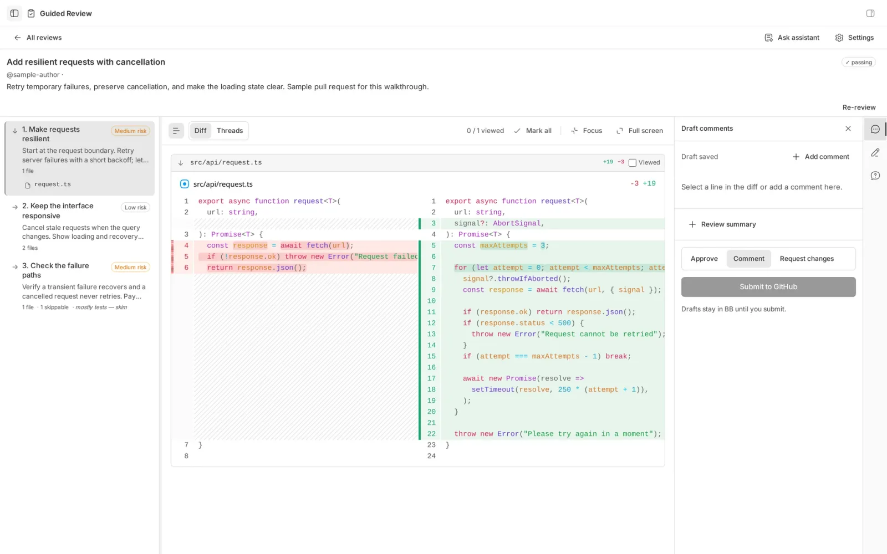
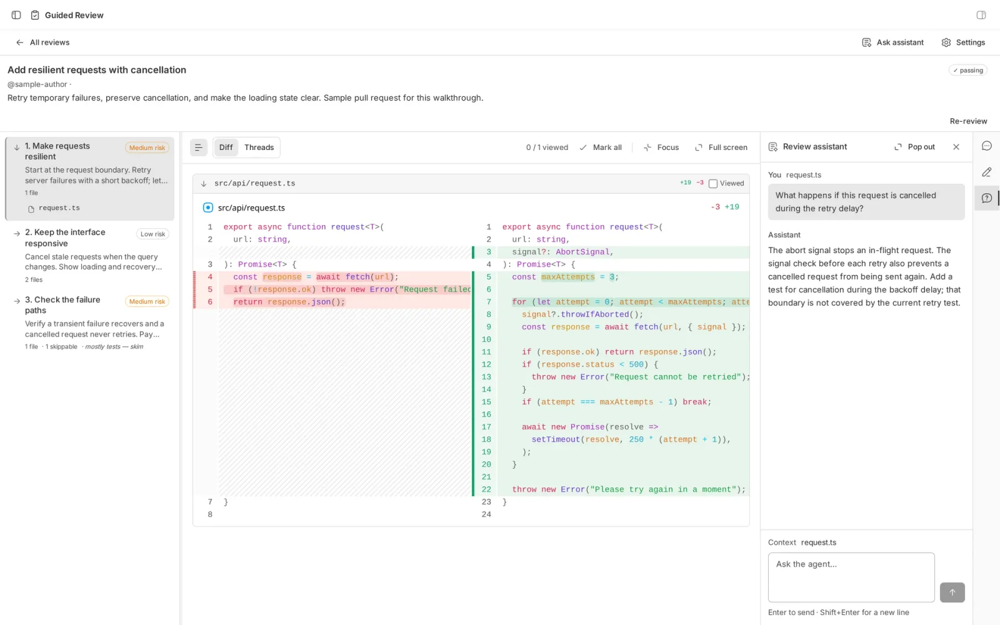
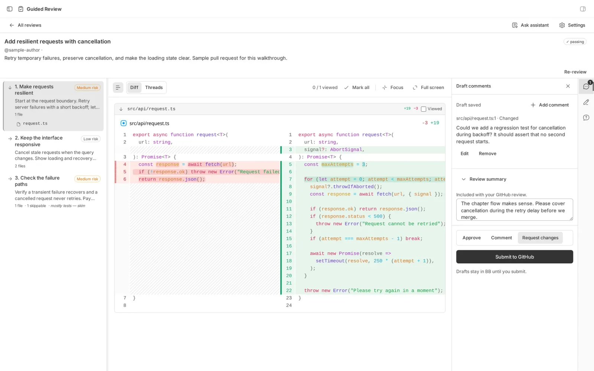

Open any pull request on GitHub and you get the same thing: every changed file, alphabetically, with a diff under each one. `.github/workflows` first. The migration that everything else depends on somewhere near the bottom. The one-line config change that actually caused the bug sitting between two lockfiles.

That order has nothing to do with how the change was made or how it should be understood. The reviewer's first job is to reconstruct the author's reasoning from a list that has thrown it away.

I wanted a tool that did the reconstruction for me. Guided Review is a plugin for [bb](https://getbb.app) that takes a pull request or a local git range, has an agent read the whole patch, and hands you back a guide: chapters, in the order the work was reasoned through, with the relevant diffs inside each one. Then it lets you review and submit from the same screen.

It is on the BB Community marketplace: `bb plugin install guided-review@bb-community`. Source at [github.com/notpritam/bb-plugin-guided-review](https://github.com/notpritam/bb-plugin-guided-review).

* * *

## What a chapter is

A chapter is a logical unit of change. Not a file, not a folder. "Move token validation into the middleware" is a chapter. It might touch four files, and those four files belong together whether or not they share a directory.

The guide puts the heart of the change first, the consequences next, and the glue (wiring, config, generated files) last. Each chapter carries a title, a short overview, a risk level, and the diffs that belong to it. The agent is told to rate risk by blast radius: public API, auth, data and concurrency changes score higher than a renamed variable.

I did not invent the idea. The chaptered walkthrough comes from the [plannotator/guides](https://github.com/plannotator/guides) project, and Guided Review says so in its settings panel. What I built is the version that lives inside bb, uses bb's agents, and closes the loop back to GitHub.

* * *

## The agent writes it. The code checks it.

Generating a guide spawns a dedicated agent thread with exactly two tools: one that reads the patch in pages, and one that submits a guide. The thread cannot touch files or run commands, and it only gets the guide-writing tool because its title starts with "Generate guide:". A second thread, the one you chat with later, gets the read tool only.

When the guide comes back, the plugin does not take the agent's word for it:

- **Every changed file must appear in exactly one chapter.** A guide that skips a file, or lists one twice, is rejected and the agent is told why.
- **The git reference is stamped by the server**, not copied from the guide. Whatever the model thinks it reviewed, the stored guide points at the commit that was actually fetched.
- **A superseded generation cannot land.** If you asked for a regenerate while a slow worker was still writing, the old result is refused instead of overwriting the new one.

These are the rules that made me trust the output. A prompt that says "please cover every file" is a wish. A check that fails the submission is a guarantee.

* * *

## Reading it

The workspace is a chapter list beside a diff viewer. Two small things carry most of the weight.

Files are tagged as test, generated, lockfile, docs, config or code by a plain path classifier with no model involved. That badge, next to the chapter's risk level, tells you where the twenty minutes should go before you have read a line.

"Viewed" is not a checkbox. Each file's diff is hashed on the server, and the hash is what you mark as viewed. Push a new commit that changes the file, and it unchecks itself, the way GitHub does it. Push a commit that doesn't touch it, and it stays viewed.

* * *

## Asking, drafting, submitting

A floating dock opens bb's own chat against the review. Select lines in the diff and they travel with the question as context. That thread has the read tool and nothing else, so it can explain what a hunk does but cannot rewrite the guide behind your back.

Draft comments and the review summary live in the plugin's own storage until you submit. Before it ever calls `gh`, the plugin walks each file's hunks and works out which line-and-side pairs GitHub's review API will accept. A comment on a line that isn't part of the diff gets a clear message in the app instead of an opaque "Unprocessable Entity" from GitHub. Submitting needs an explicit verdict, approve, comment or request changes, and a final click. Drafting never posts anything.

A background job checks GitHub every minute, so CI status, thread state and merges show up in the sidebar without a refresh. Since 0.2.1, a finished or failed guide also raises an alert through Needs You, the inbox plugin, with a popup that opens the guide directly.

* * *

## What it taught me about agent tools

Scope tools by the job, not by the plugin. Two threads spawned by the same plugin got different tool sets because they had different jobs, and the extra ten lines of gating removed a whole class of "the assistant helpfully regenerated my guide" surprises.

Validate at the boundary. The agent produces JSON; the plugin decides whether that JSON is a guide. Coverage, provenance and generation ordering are all things a model can get wrong on a good day, and none of them should depend on it having a good day.

And keep the human on the last click. The plugin drafts, checks and explains, and then it waits for you.

* * *

*Guided Review 0.2.1 is free, open source, and needs bb 0.41 or later. Install it, run `bb review` on the next PR you're dreading, and tell me where the chapters got it wrong.*
