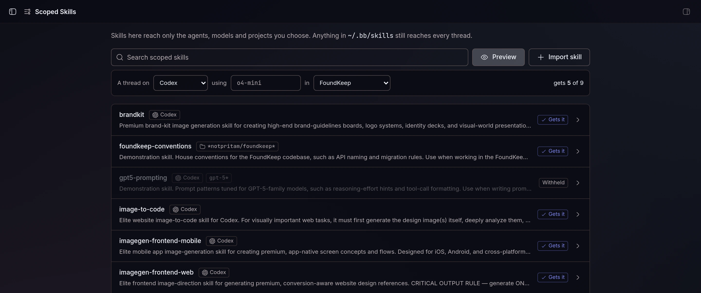

I run Claude Code and Codex side by side inside [bb](https://getbb.app), and over a few months they each grew their own pile of skills. Some I installed with `npx skills`, some came from plugins, some I wrote. Some lived in `~/.claude/skills`, some in `~/.codex/skills`, and a lot of them in `~/.agents/skills`, symlinked back and forth so that deleting one folder would quietly break two agents.

When I finally counted, bb listed 193 skill entries on my machine: 47 distinct skills I had installed myself, twelve plugin packs, and six Codex built-ins. Two thirds of them existed in more than one place.

The plan was simple: move everything to bb's own skill folder, `~/.bb/skills`, so every agent gets the same set and I stop caring which tool installed what. That worked for most of them. It broke on four.

* * *

## The skills that shouldn't go everywhere

bb's rule is that every skill in `~/.bb/skills` reaches every thread, whatever agent runs it. Usually that's what you want. But four of my skills generate images (`brandkit`, `image-to-code`, `imagegen-frontend-web` and `imagegen-frontend-mobile`), and only Codex has an image tool. In a Claude Code thread they're dead weight: the description invites the model to use a skill it can't carry out.

The same thing happens with models. A prompt playbook tuned for GPT-5 doesn't belong in a session running something else.

What I wanted was a scope on the skill itself: *these agents*, optionally *these models*, and nobody else.

* * *

## bb already asks the right question

bb's plugin SDK has a hook, `bb.agents.configure`. When a thread starts, bb calls it with the thread's context, including which agent and model are running and which project it's in, and the plugin answers with the names of its own skills and tools to inject. Any of the plugin's skills it leaves out don't reach that session.

So the whole feature is a library of skills, each with a scope, plus a configure callback that filters it:

```ts
bb.agents.configure((context) => ({
  tools: [...TOOL_NAMES],
  skills: [
    GUIDE_SKILL,
    ...preview(context.provider.id, context.provider.model, {
      id: context.project.id,
      name: context.project.name,
      gitRemoteUrl: context.project.gitRemoteUrl,
    }).included,
  ],
}));
```

`preview` walks the library and checks each scope. A scope is a list of agent ids, a list of model globs and a list of project globs; leaving one out means no limit on it:

```ts
export function scopeMatches(scope: Scope, agent: string, model: string, project: ProjectRef | null): boolean {
  if (scope.agents !== null && !scope.agents.includes(agent)) return false;
  if (scope.models !== null && !scope.models.some((p) => globToRegExp(p).test(model))) return false;
  if (scope.projects !== null && (project === null || !projectMatches(scope.projects, project))) return false;
  return true;
}
```

The callback has to be synchronous, so the scopes live in memory and are refreshed whenever the library changes.

* * *

## Where the skills actually live

This part took more thought than the filtering.

A plugin can only select skills from its own manifest skill folders. But a plugin installed from a marketplace lives in bb's plugin cache, and an update replaces that folder. Any skill you added would vanish on the next release.

So the source of truth is the plugin's SQLite database: one table for skills and scopes, one for file contents. When the plugin loads, and after every change, it writes the whole library to a `library/` folder that bb scans as a skill root. It writes to a staging folder first and swaps it in, so bb never sees half a library. Updates can replace the plugin folder as often as they like, and the next load writes the library back.

* * *

## Three things I learned migrating 50-odd skills

**bb parses frontmatter strictly, and it doesn't tell you.** One of my skills had `description: … feedback and motion: adding hover states …`. The unquoted `: ` is invalid YAML. Claude Code didn't care, so I'd never noticed, but bb left the skill out without a word. It got me twice: `handoff` had the same problem (`…the current machine: "moving to the VM"…`). Because an identical copy also sat in `~/.claude/skills`, I first blamed the duplicate. Deleting the duplicate changed nothing; quoting the description fixed it. Scoped Skills' import uses a strict YAML parser on purpose, so it rejects such a file with the reason and the fix (quote it, or use `description: >-`).

**Skills that point at themselves break when they move.** Two of mine ran their own scripts through `~/.claude/skills/<name>/…`. Once a skill lives somewhere else, those paths go nowhere. Grep for the old path before you delete anything.

**Prefer the registry when there is one.** For anything that originally came from skills.sh, `bb skill install <id>` beats copying files, because bb records where the skill came from. Two of mine had disappeared upstream, and the registry was out of date about that, so those were the only ones I copied by hand.

* * *

## What it looks like

There's a Scoped Skills page in the sidebar, laid out like bb's own Skills pages. Each skill is a row with its scope shown as badges. **Preview** answers "what would a thread on this agent, model and project get?":



Click a skill to change who gets it. Agents are picked by logo; models and projects are chips. A project glob tells you right away which of your projects it matches, so a typo that would silently match nothing is obvious:


(`foundkeep-conventions` and `gpt5-prompting` are demonstration skills I made for these screenshots. The image skills are real.)

The same operations exist as a CLI:

```sh
bb scoped-skills import ~/.claude/skills/brandkit --agents codex
bb scoped-skills scope gpt5-prompting --agents codex --models 'gpt-5*'
bb scoped-skills preview --agent claude-code --model claude-opus-5-5
```

and as agent tools, so you can tell a thread "make brandkit Codex-only" and it does it.

**Update, October 5:** v0.2 added the project scopes you see above, and v0.2.1 rebuilt the page. Each entry is a glob matched against a project's name, id or git remote, so my work skills now carry `--projects '*emergentbase/*,work'`. They reach every agent, but only in work repos, and never in my personal projects.

* * *

## Did it work?

Unit tests run the plugin against the SDK's fake host and check what `configure` returns for each agent. But the real test was two fresh threads, one on Claude Code and one on Codex, each asked to list which of a handful of skills it had:

```text
Claude Code → HAVE: scoped-skills, local-video-edit, hyperframes
Codex       → HAVE: brandkit, image-to-code, imagegen-frontend-mobile,
                    imagegen-frontend-web, scoped-skills, local-video-edit, hyperframes
```

Same machine, same skill folders. The shared skills reach both, and the image skills reach only the agent that can use them.

* * *

## Limits

- A scope change applies to new sessions. A thread that's already running keeps the skills it started with.
- A copy of the same skill left in `~/.bb/skills`, `~/.claude/skills` or `~/.codex/skills` still reaches every agent and defeats the scope.
- Models are matched as bb reports them, so globs (`gpt-5*`, `claude-opus-*`) hold up better than exact version strings.
- A project-scoped skill never reaches a thread whose project doesn't match, including a thread with no project.

## Try it

Scoped Skills is in BB Community: open **Extensions** in bb and search for it, or run

```sh
bb plugin install scoped-skills@bb-community
```

The source is on [GitHub](https://github.com/notpritam/bb-plugin-scoped-skills) under MIT. It's about 1,800 lines of TypeScript: roughly 600 for the server, CLI and tools, 960 for the page, and 230 for the library and scope logic.
